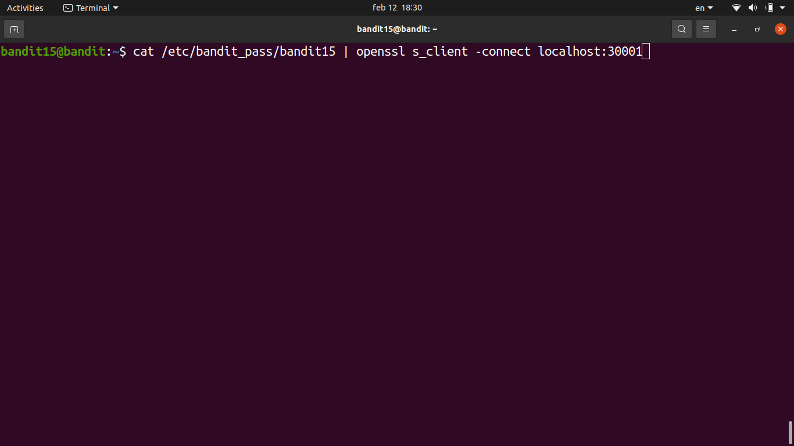
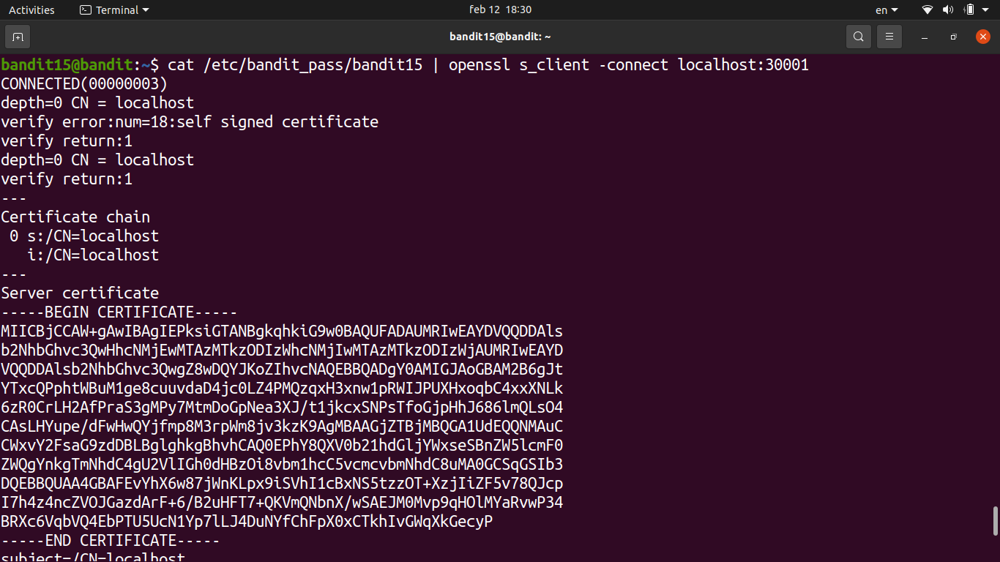
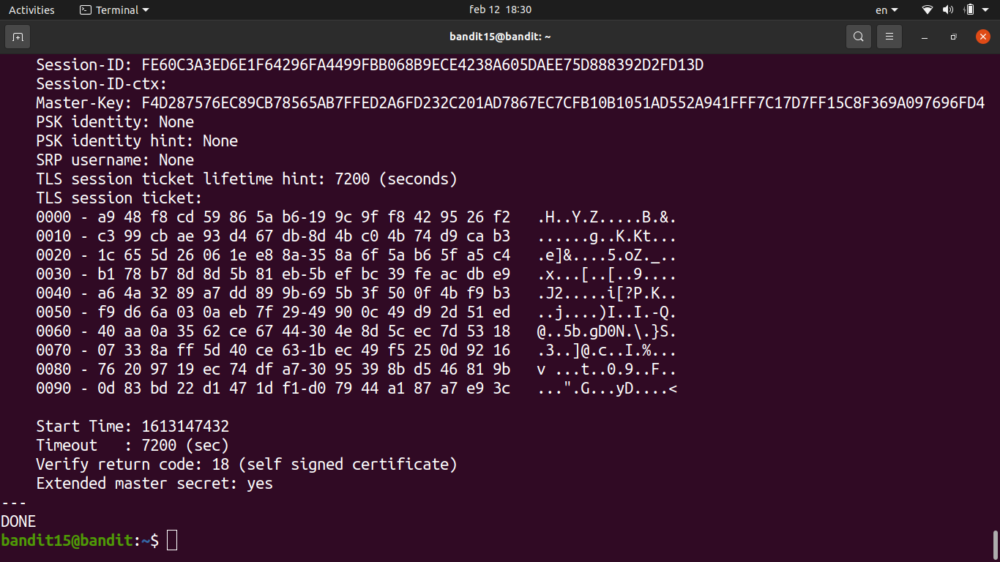
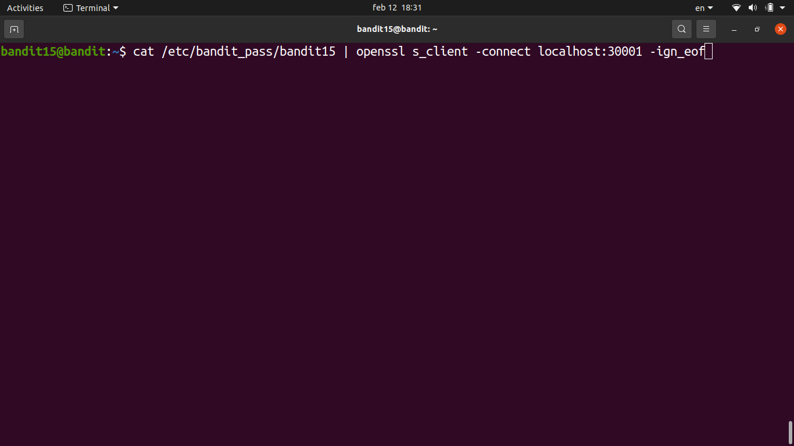
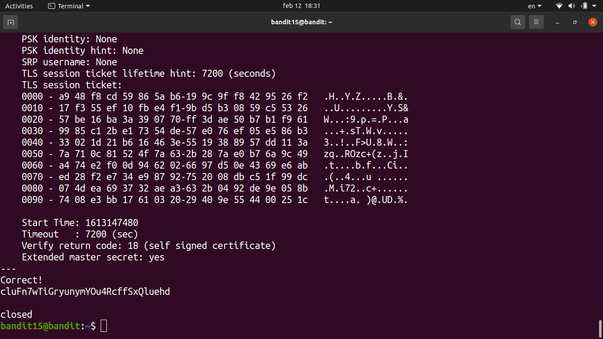
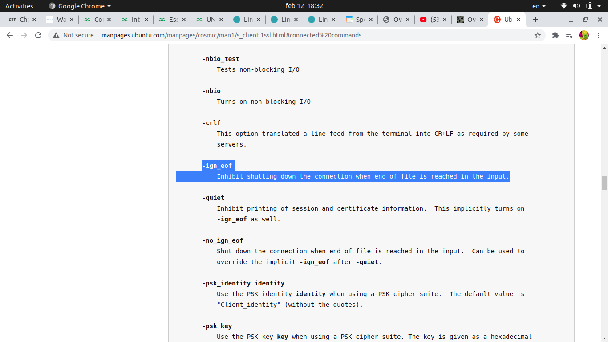

# [Bandit Level 15](https://overthewire.org/wargames/bandit/bandit15.html)

- The goal here is to submit the current level's password to port **30001** on localhost, but this time the connection must be made using **SSL/TLS encryption** (`nc` won't work).

- For SSL connections we use `openssl s_client`, which is the standard tool for connecting to SSL/TLS-enabled services from the command line.
	- The `-connect` flag specifies the host and port in `host:port` format.
	- The `-ign_eof` flag tells openssl not to close the connection when it hits EOF, giving us time to type/paste the password.

- Connected to the local service on port 30001 via SSL.

- Pasted the current level's password. The service responded with `Correct!` and returned the next password.

### Password

`BfMYroe26WYalil77FoDi9qh59eK5xNr`
