# [Bandit Level 16](https://overthewire.org/wargames/bandit/bandit16.html)

- There are several ports open in the range **31000–32000** on localhost. 
	- The challenge is to figure out which one speaks SSL and also returns the next credentials, rather than just echoing back what you send it.

- First step is scanning the port range with `nmap` to see what's open and what services are running.
	- This quickly narrows down which ports speak SSL vs. plain TCP.

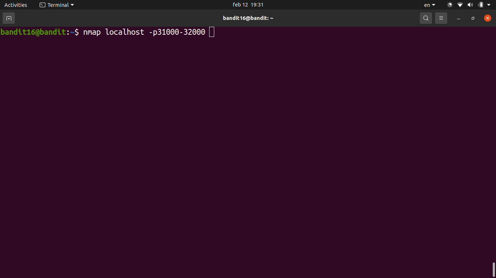

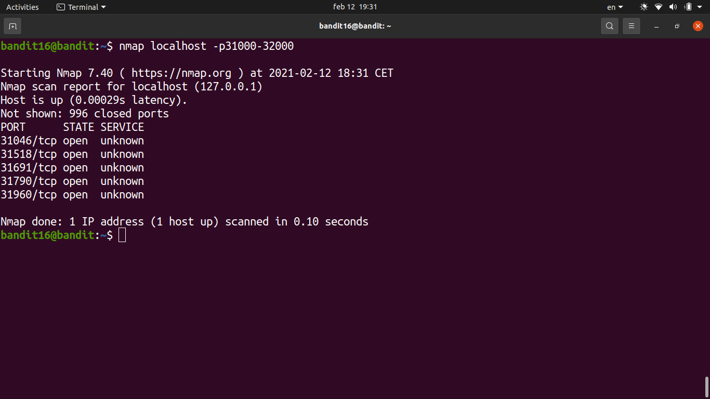

- Identified the correct SSL port from the nmap output — only one of them returns credentials instead of echoing.

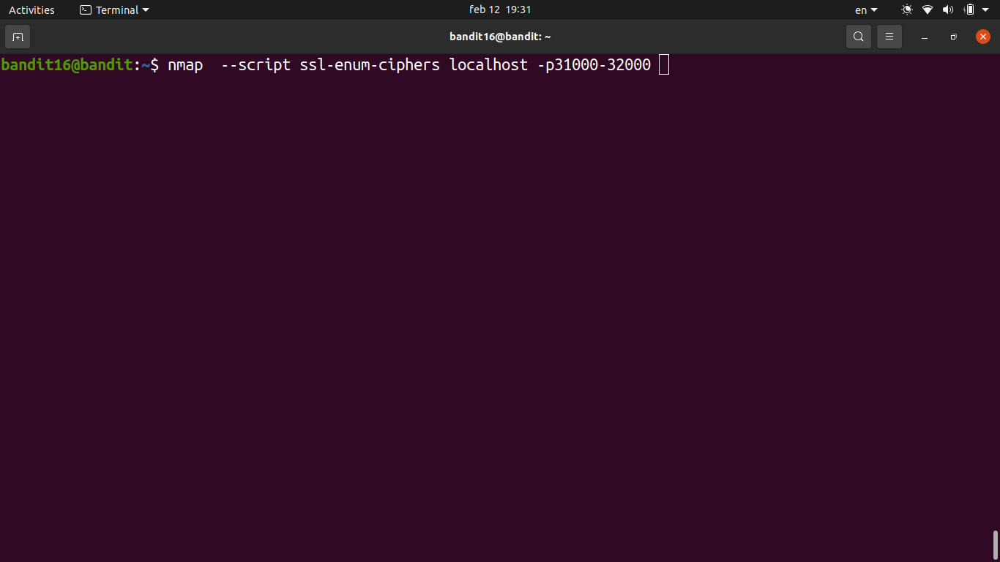

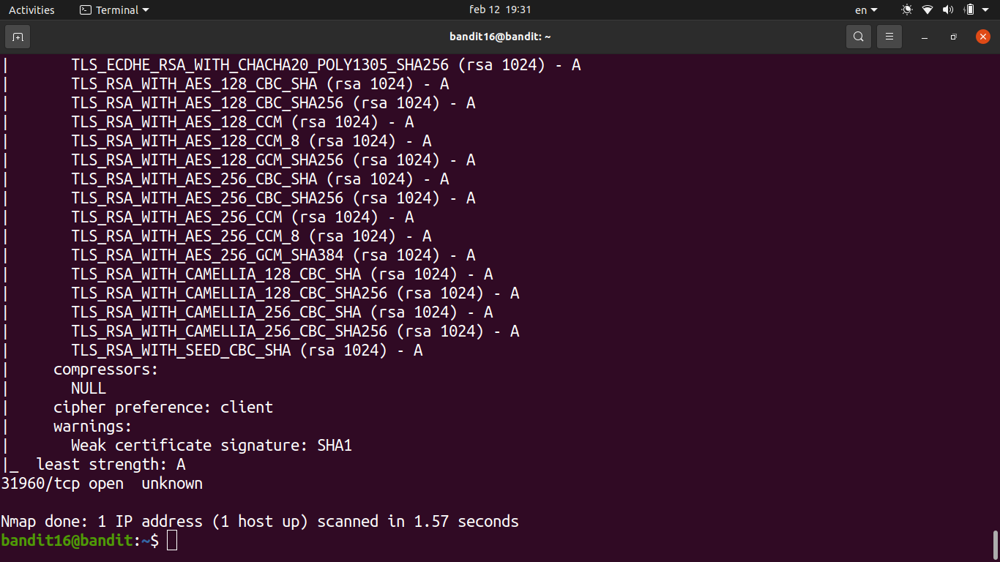

- Connected using `openssl s_client -connect localhost:<port>` and submitted the current password.

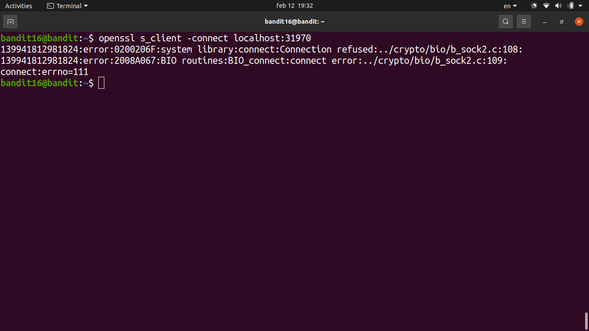

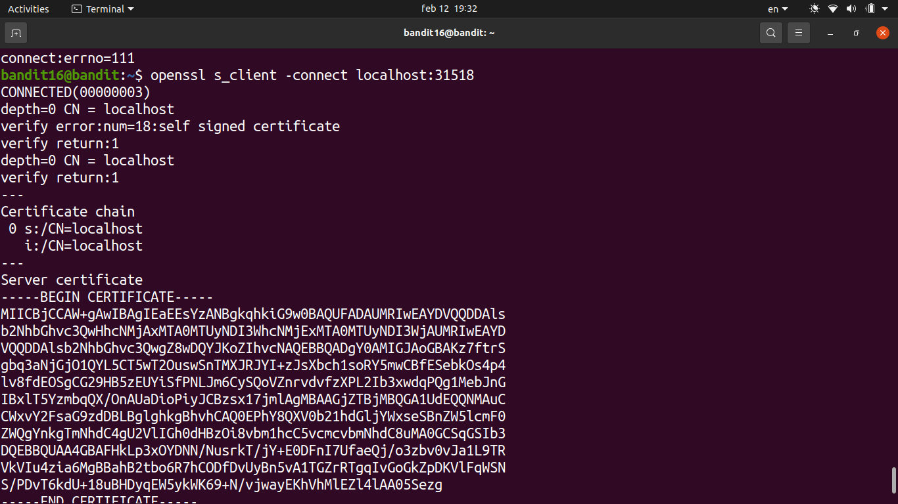

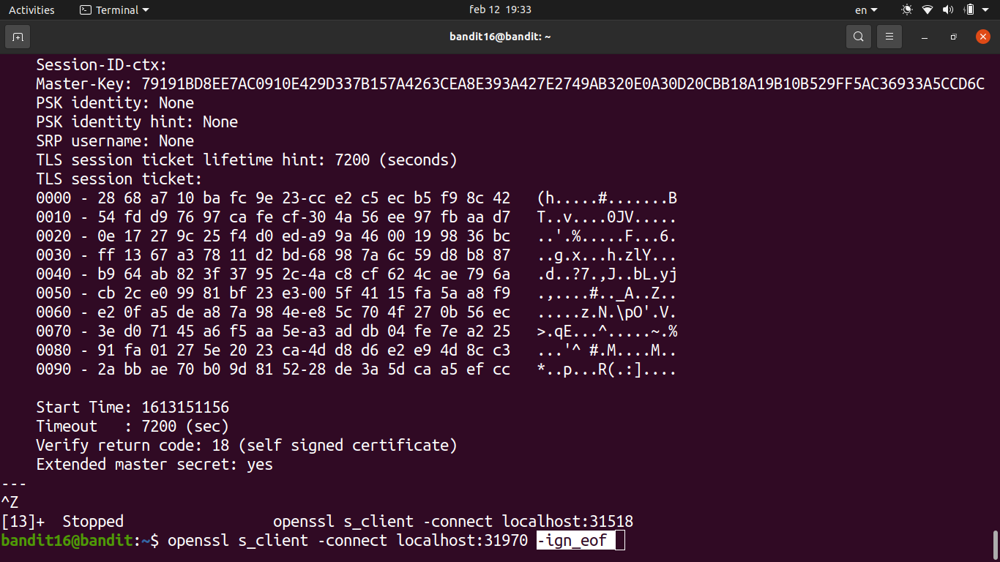

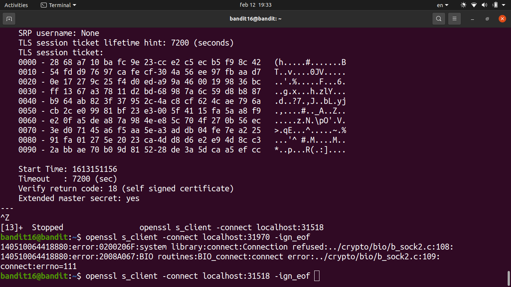

- The service responded with an **RSA private key** instead of a plain password. This is the SSH key for bandit17.

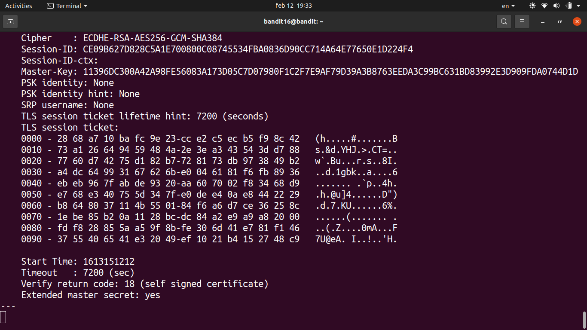

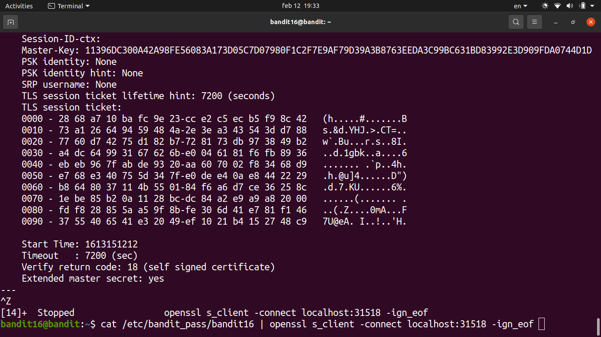

- Saved the private key to a file in `/tmp`, then set the correct permissions with `chmod 400` — SSH won't accept a key file that's world-readable.

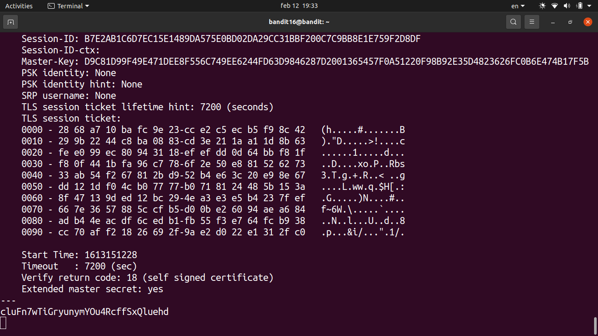

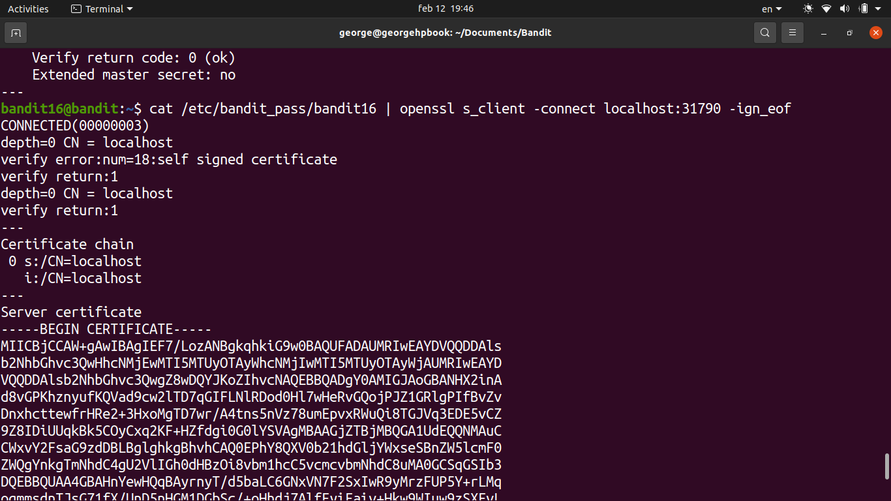

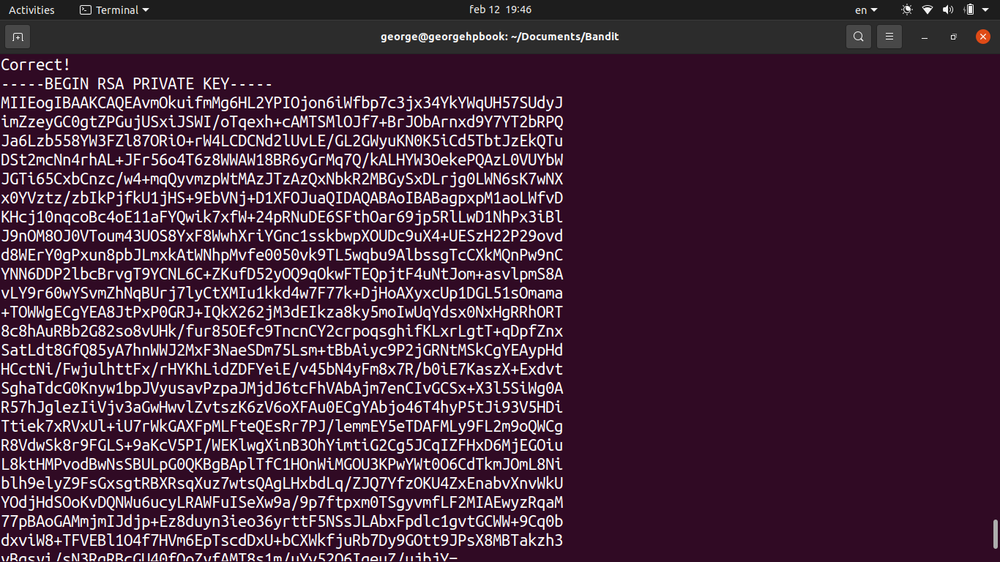

- Used the key to SSH into bandit17: `ssh -i /tmp/key.pem bandit17@localhost -p 2220`

### Password

`cluFn7wTiGryunymYOu4RcffSxQluehd`
