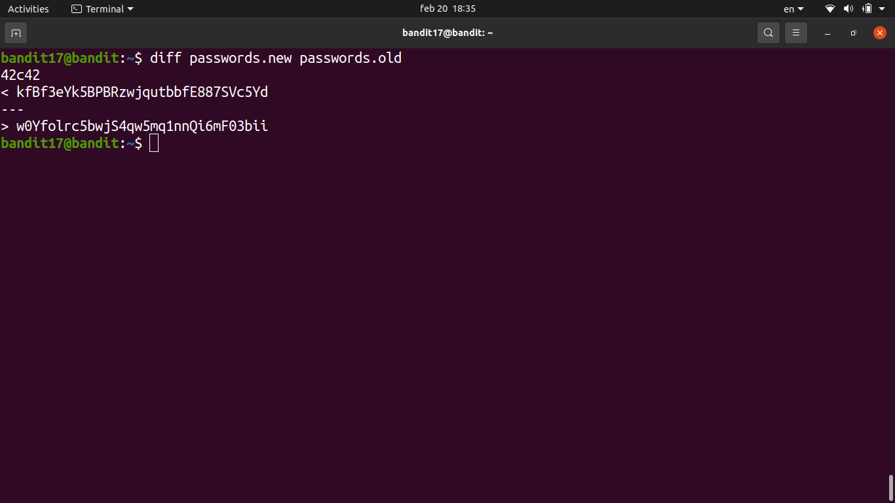
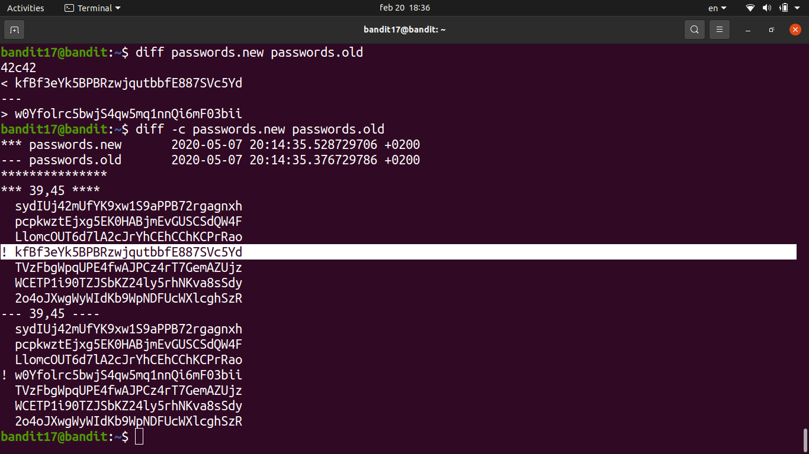

# [Bandit Level 17](https://overthewire.org/wargames/bandit/bandit17.html)

- There are two files in the home directory: `passwords.old` and `passwords.new`. The password for the next level is the **one line in `passwords.new` that doesn't exist in `passwords.old`**.

- `diff passwords.old passwords.new` compares the two files line by line and outputs only what changed.
	- Lines starting with `<` are from the first file (old), lines with `>` are from the second (new).
	- Since only one line changed, the output is short and the new password is immediately visible.

### Password

*(RSA private key used to log in — see bandit16 writeup)*
`kfBf3eYk5BPBRzwjqutbbfE887SVc5Yd`
