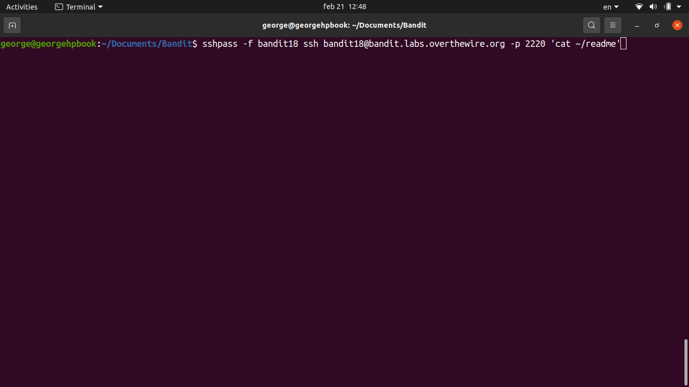
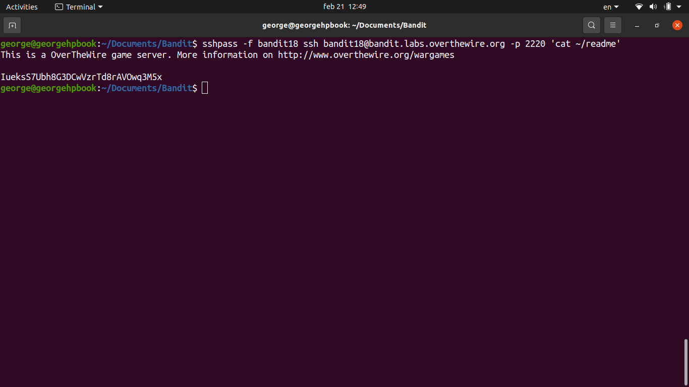

# [Bandit Level 18](https://overthewire.org/wargames/bandit/bandit18.html)

- When you try to SSH in, you get kicked out immediately with the message `Byebye!`. Someone has modified `.bashrc` to run `exit` as soon as an interactive shell starts.

- The trick is to pass a command **directly to SSH** so it executes before the shell even loads `.bashrc` interactively.
	- `ssh bandit18@localhost -p 2220 cat readme` appends `cat readme` at the end of the ssh command, which runs the command on the remote machine without spawning an interactive shell.
	- This bypasses `.bashrc` entirely and just dumps the file contents.

### Password

`kfBf3eYk5BPBRzwjqutbbfE887SVc5Yd`
