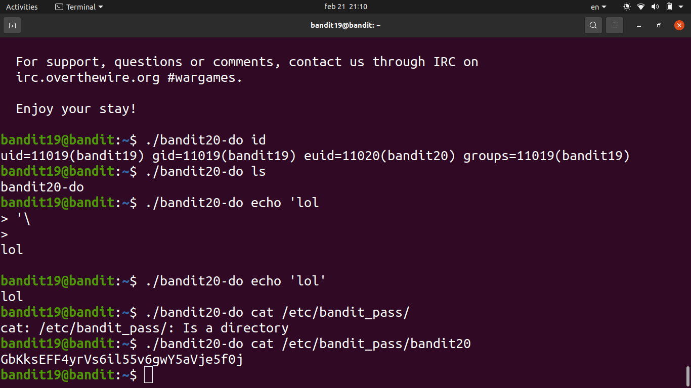

# [Bandit Level 19](https://overthewire.org/wargames/bandit/bandit19.html)

- There's a setuid binary in the home directory. A **setuid** (SUID) binary runs with the **file owner's permissions** rather than the caller's — so even though we're bandit19, the binary executes as bandit20.

- Running `./bandit20-do cat /etc/bandit_pass/bandit20` lets us read the password file that would normally be off-limits.
	- The binary basically gives us a one-shot privilege escalation — we can only run commands as bandit20 through it, not get a full shell.

### Password

`IueksS7Ubh8G3DCwVzrTd8rAVOwq3M5x`
