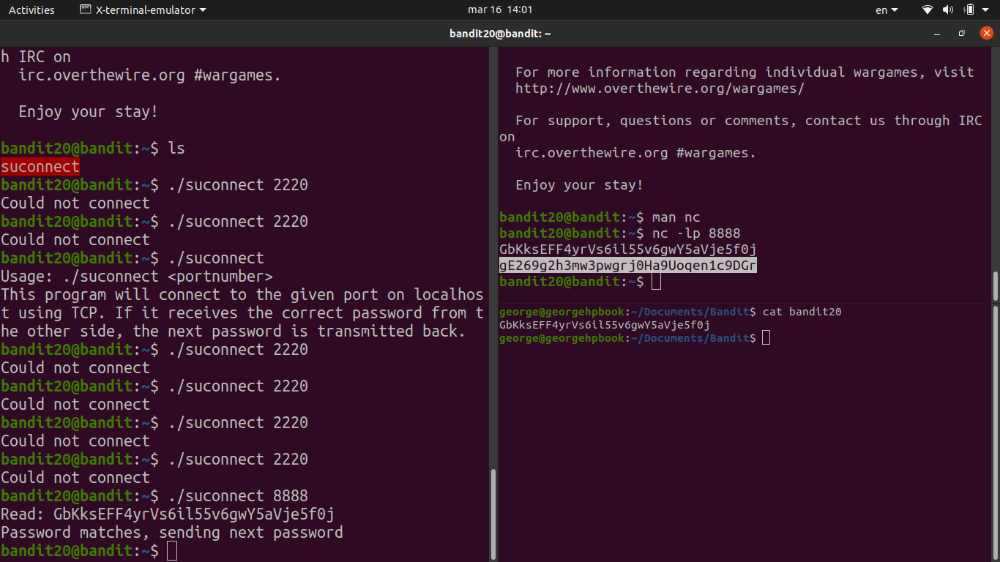

# [Bandit Level 20](https://overthewire.org/wargames/bandit/bandit20.html)

- There's a setuid binary called `suconnect` in the home directory. It connects to a port on localhost, reads one line of input, and if it matches the current level's password it returns the next one.

- The trick here is that **we need to be the one listening**. We set up a `nc` listener in the background that serves the current password, then run the binary pointing at our listener port.
	- `echo "GbKksEFF4yrVs6il55v6gwY5aVje5f0j" | nc -lp 1234 &` starts a listener in the background (`&`) that will send the password to whoever connects.
	- Then `./suconnect 1234` connects to our listener, reads the password, validates it, and sends back the next one.

### Password

`GbKksEFF4yrVs6il55v6gwY5aVje5f0j`
