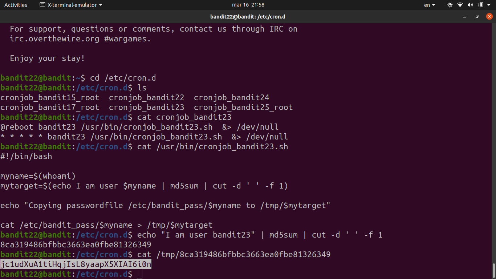

# [Bandit Level 22](https://overthewire.org/wargames/bandit/bandit22.html)

- There's a cron job running periodically as **bandit23**. 
	- The goal is to read the script it's running and figure out where it's writing the password.

- Checked `/etc/cron.d/cronjob_bandit23` to find the script path, then read the script itself.
	- The script generates an `md5sum` of the string `"I am user bandit23"` and writes the bandit23 password to `/tmp/<that_hash>`.
	- We can reproduce the same hash ourselves: `echo "I am user bandit23" | md5sum | cut -d ' ' -f 1` gives us the filename.

- Read `/tmp/<hash>` and got the password.

### Password

`Yk7owGAcWjwMVRwrTesJEwB7WVOiILLI`
