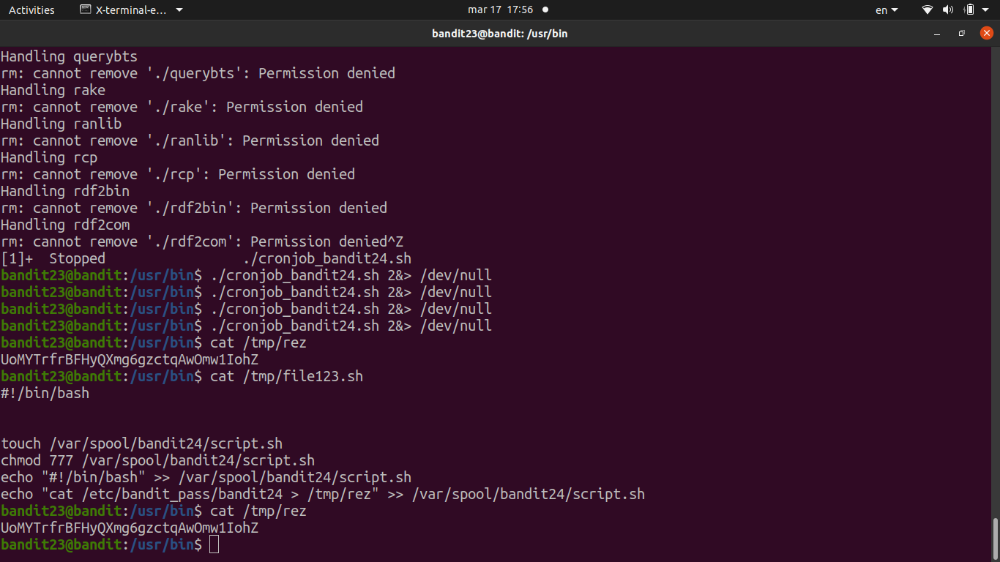

# [Bandit Level 23](https://overthewire.org/wargames/bandit/bandit23.html)

#bandit #overthewire #cron #cronjob #bash #scripting

- A cron job runs as **bandit24** and executes every script it finds in `/var/spool/bandit24/`, then deletes them. We can abuse this to run our own script as bandit24 and have it dump the password somewhere we can read it.

- I initially thought the script executed every second (which would've been too fast to work reliably) so I wrote the script in `/tmp` first rather than dropping it straight into `/var/spool/bandit24/`.
	- The script needed a **shebang line** (`#!/bin/bash`) so the shell knows how to run it.
	- Then a `cat /etc/bandit_pass/bandit24 >> /tmp/rez` line to read the password and append it to a file in `/tmp` that I have access to.
	- Had to `chmod 777` both the script and the `/tmp/rez` output file, otherwise bandit24 wouldn't have write permission to drop the result there.

- Moved the script into `/var/spool/bandit24/` and waited for the cron job to fire.

- After a minute, checked `/tmp/rez` — the password was there.

### Password

`jc1udXuA1tiHqjIsL8yaapX5XIAI6i0n`
