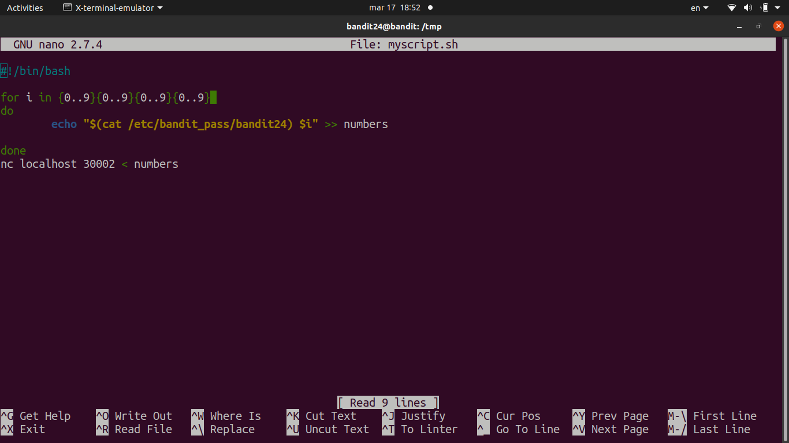

# [Bandit Level 24](https://overthewire.org/wargames/bandit/bandit24.html)

- There's a daemon running on port **30002** that expects the current password followed by a **4-digit secret PIN** (0000–9999). 
	- There's no way to look up the PIN — we need to brute-force all 10,000 combinations.

- Wrote a bash script to generate all combinations and pipe them to `nc`.
	- Used a `for` loop from 0000 to 9999 with `printf "%04d"` to zero-pad single/double digit numbers.
	- Each line is formatted as `<password> <pin>` and echoed into a file, then the whole file is fed to `nc localhost 30002`.
	- Piped the output through `grep -v Wrong` to filter out all the failed attempts and see only the success line.

- Got the response `Correct!` with the next password after the correct PIN was found.

### Password

`UoMYTrfrBFHyQXmg6gzctqAwOmw1IohZ`
