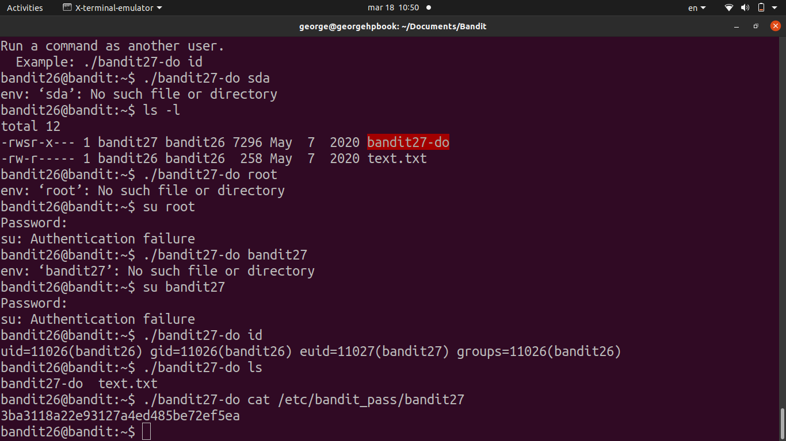

# [Bandit Level 26](https://overthewire.org/wargames/bandit/bandit26.html)

- bandit26's default shell (set in `/etc/passwd`) is not `/bin/bash`, but a custom script that just runs `more` on a text file and then exits. 
	- So even if we SSH in with a valid key, we get kicked out immediately after `more` finishes.

- The key to escaping `more` is to **make the terminal window small enough** that the text doesn't fit on screen and `more` is forced into interactive/pager mode instead of just printing and quitting.
	- Zoomed in a lot in the terminal to reduce the visible lines, then SSHed in 
		- `more` paused waiting for input.

- Once stuck in `more`, pressed `v` to open the current file in **vim**.
	- From vim, used `:set shell=/bin/bash` to change the shell vim would use, then `:shell` to drop into a real bash session.

- From there explored the home directory, found a `to do` file with the SUID bit set, ran `cat` on it and got the flag.

### Password

`5czgV9L3Xx8JPOyRbXh6lQbmIOWvPT6Z`
