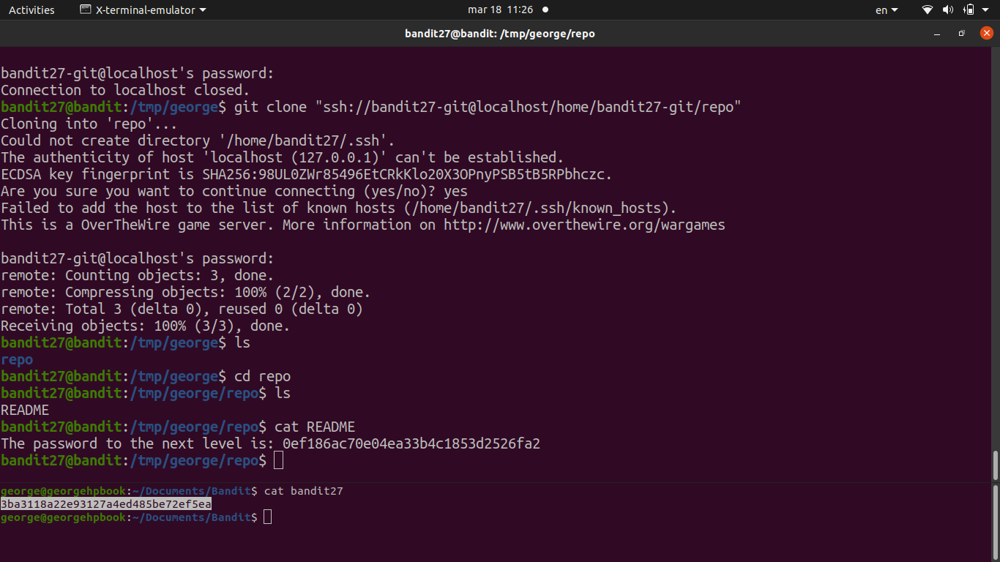

# [Bandit Level 27](https://overthewire.org/wargames/bandit/bandit27.html)

- There's a git repository at `ssh://bandit27-git@localhost/home/bandit27-git/repo`. The password for the repo is the same as bandit27's SSH password. 

- `git clone ssh://bandit27-git@localhost:2220/home/bandit27-git/repo /tmp/repo27` clones the repo into a temp directory (we can't write to the home directory).
	- Once cloned, the password is just sitting in a `README` file inside the repo.

### Password

`3ba3118a22e93127a4ed485be72ef5ea`
