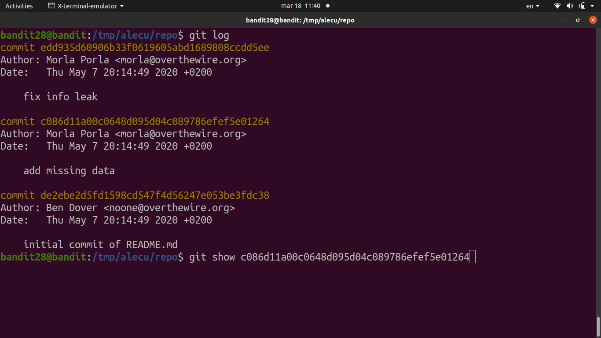

# [Bandit Level 28](https://overthewire.org/wargames/bandit/bandit28.html)

- Same as before: clone the repo at `ssh://bandit28-git@localhost/home/bandit28-git/repo`. 
	- this time the `README.md` inside has the password field filled with `xxxxxxxxxx

- The password was probably in a previous commit before someone cleaned it up. 
- `git log` shows the commit history and `git show <hash>` lets us inspect any individual commit.
	- Found a commit with the message "fix info leak" 
	- The commit right before it still had the real password visible in the diff

### Password

`0ef186ac70e04ea33b4c1853d2526fa2`
