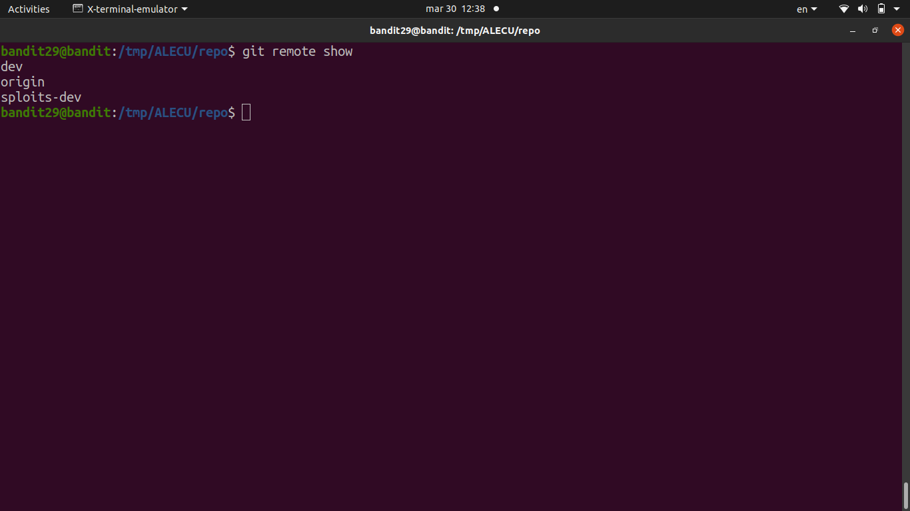
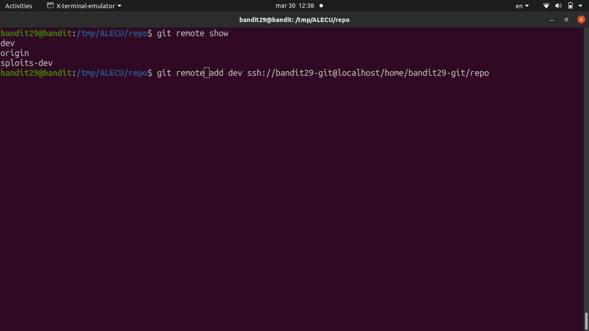
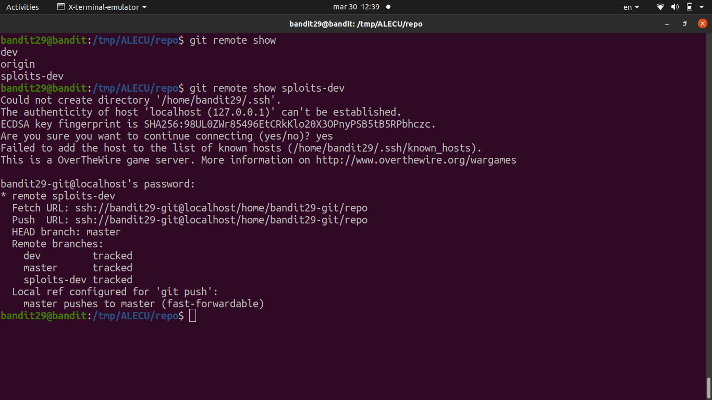
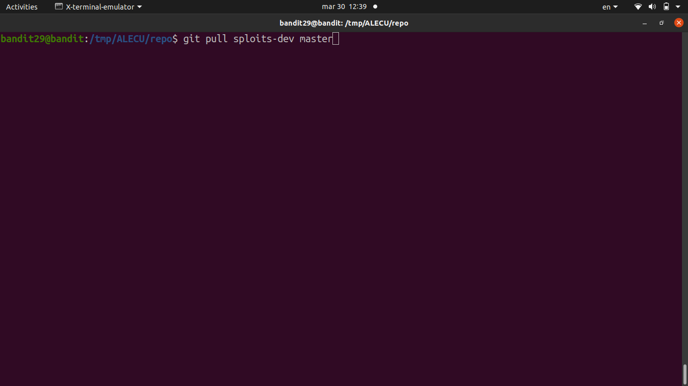
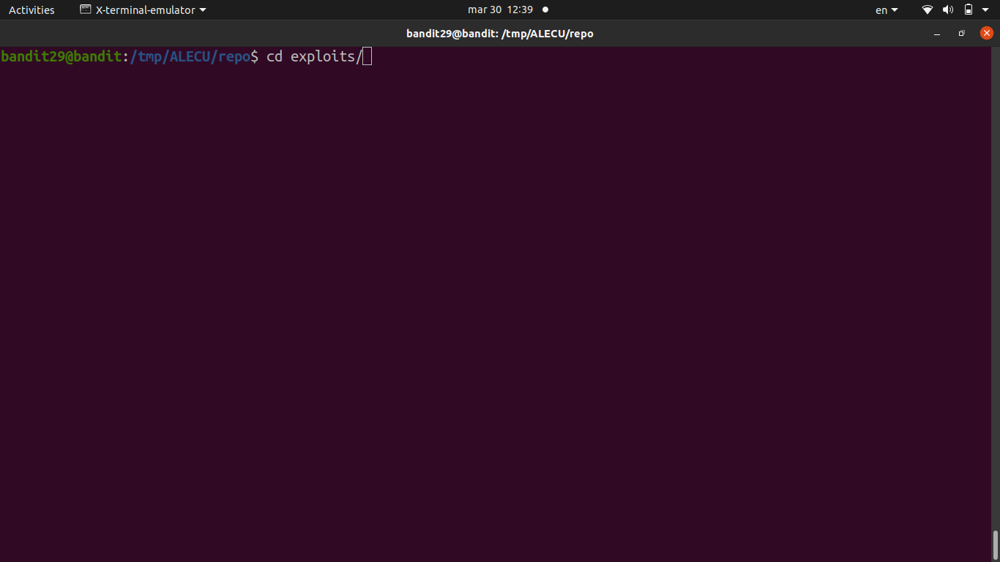
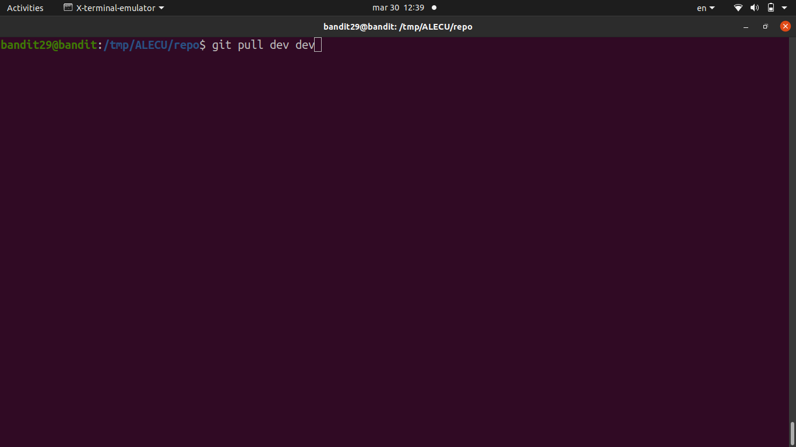
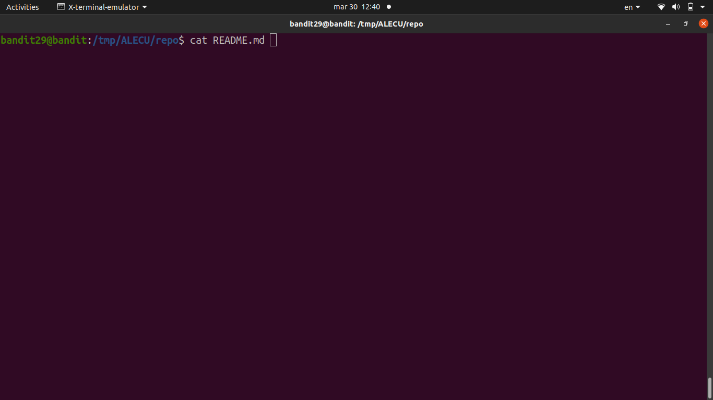
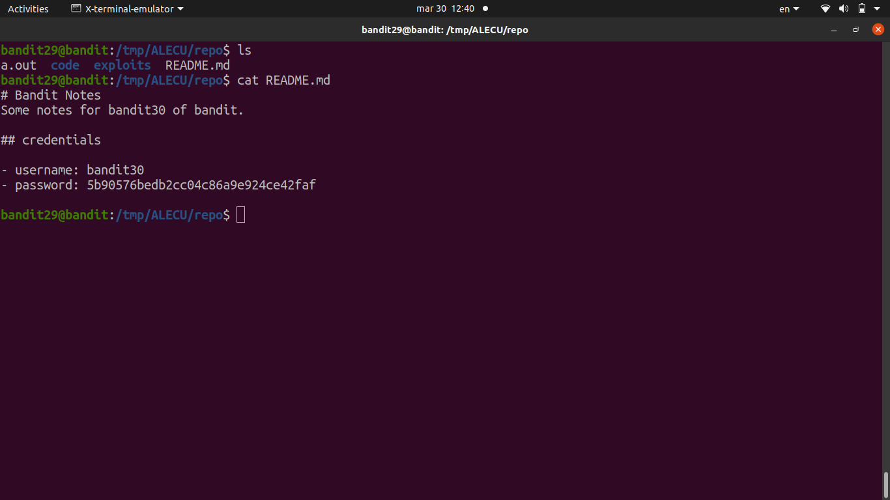

# [Bandit Level 29](https://overthewire.org/wargames/bandit/bandit29.html)

- Cloned the repo again at `ssh://bandit29-git@localhost/home/bandit29-git/repo`. 
- The `README.md` on the main branch says "no passwords in production!" 
	- so the password isn't here, but the hint tells us to look elsewhere.

- The key is to check the **other branches**
	- `git branch -a` lists all branches including remote ones.
	- Found a `dev` branch
		- checked it out with `git checkout dev`.
	- The `README.md` on that branch had the actual password.

### Password

`bbc96594b4e001778eee9975372716b2`
