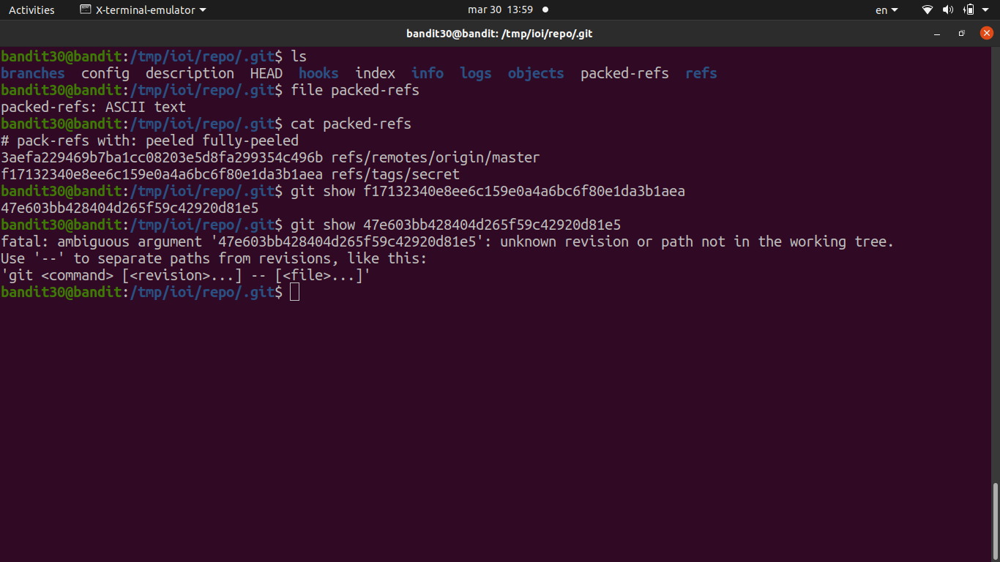
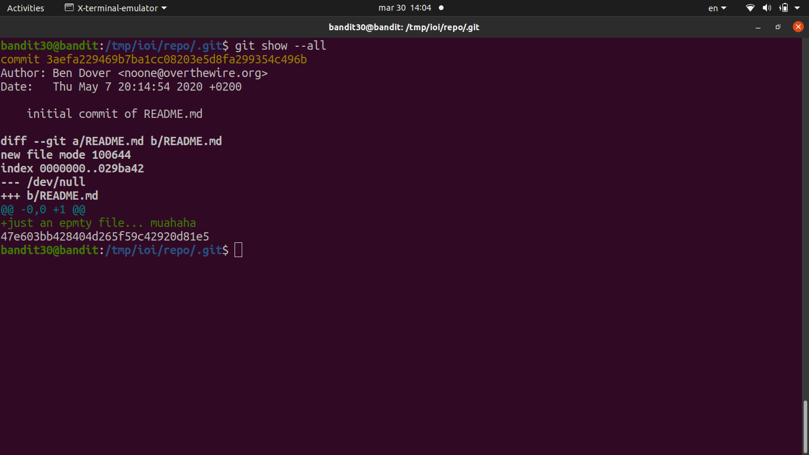

# [Bandit Level 30](https://overthewire.org/wargames/bandit/bandit30.html)

- Cloned the repo at `ssh://bandit30-git@localhost/home/bandit30-git/repo`.
	- The README is empty and there are no interesting commits or branches this time.

- The trick here is **git tags** 
	- `git tag` lists any tags in the repo and there's one called `secret`.
	- `git show secret` reveals the contents of that tag, which is the password.
	- Tags in git are often used to mark releases or important points, but they can also be used to hide data that isn't on any branch.

### Password

`5b90576bedb2cc04c86a9e924ce42faf`
