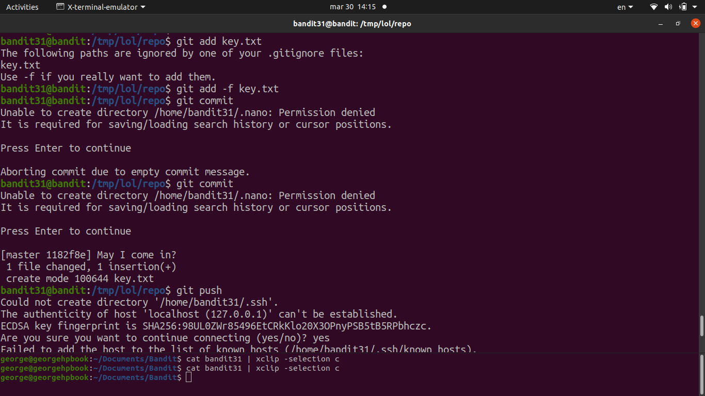
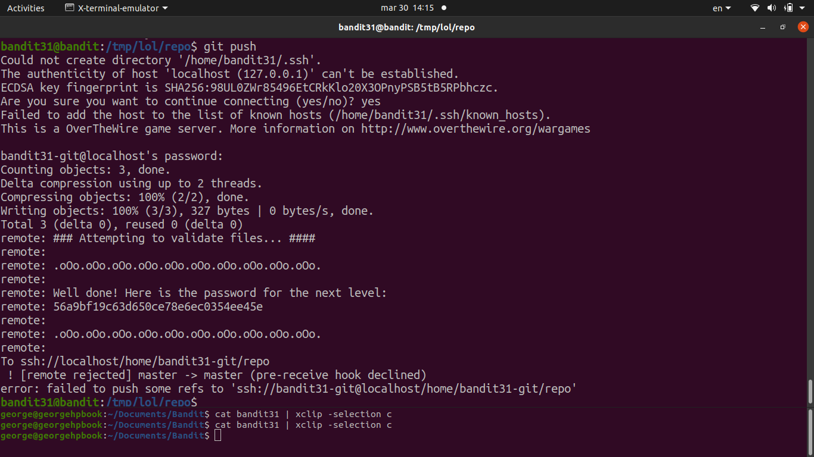

# [Bandit Level 31](https://overthewire.org/wargames/bandit/bandit31.html)

- The README in this repo says to create a file called `key.txt` with the content `May I come in?` and push it to the remote's `master` branch. 
	- The server checks what we push and responds with the password.

- Created the file and tried to `git add key.txt` but it was being ignored by `.gitignore` which had `*.txt` in it.
	- Used `git add -f key.txt` to **force-add** the file despite the `.gitignore` rule.
	- Then `git commit -m "push key"` and `git push origin master`.
	- The server validated the file content and returned the next password in the push response.

### Password

`47e603bb428404d265f59c42920d81e5`
