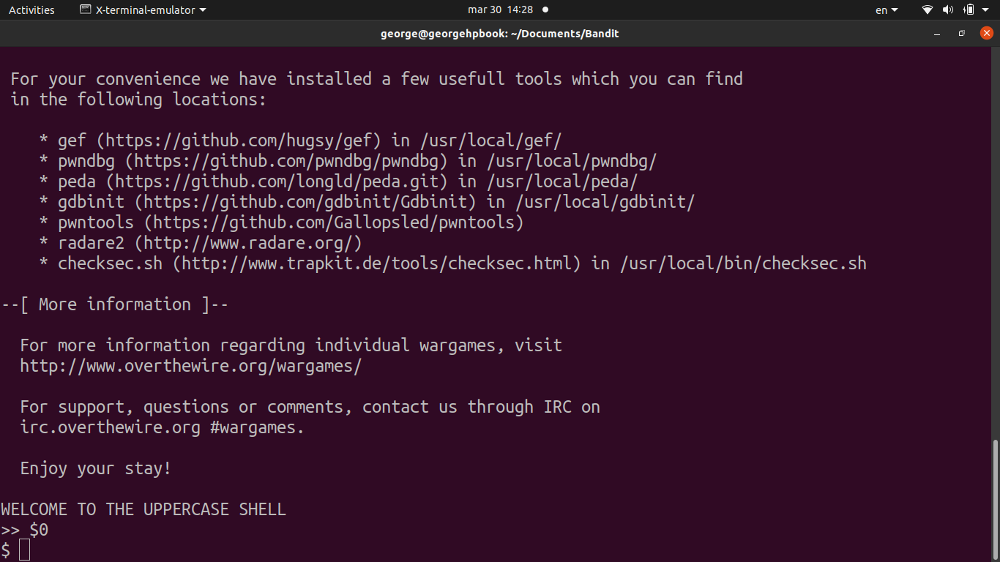
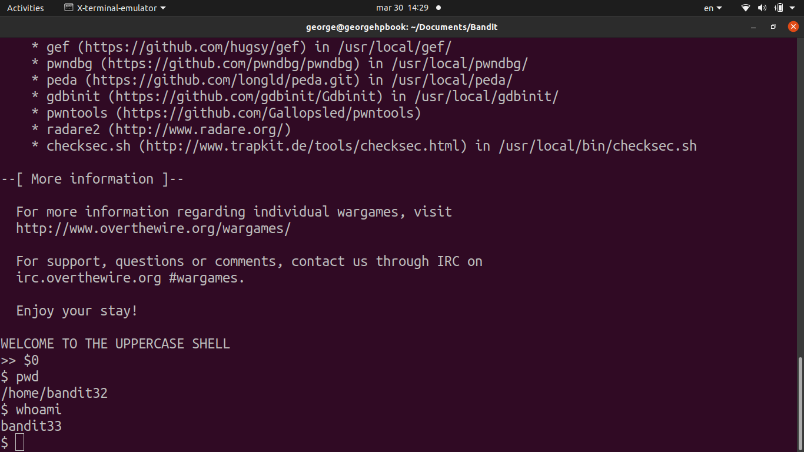
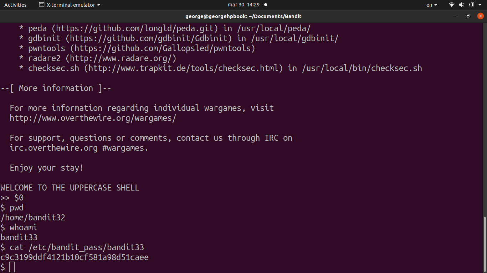

# [Bandit Level 32](https://overthewire.org/wargames/bandit/bandit32.html)

- After logging in, you're dropped into what the prompt calls the "UPPERCASE SHELL", which converts everything you type to uppercase before executing it. 
	- So commands like `ls`, `cat`, `sh` all become `LS`, `CAT`, `SH` and fail.

- The trick is that **shell special variables don't get uppercased** because they're not alphabetical commands, but symbols.
	- `$0` is a special variable that holds the name of the currently running shell or script.
	- Typing `$0` tells the uppercase shell to execute the value of `$0`, which is the shell binary itself 
		- i.e. spawning a new normal shell.
	- From there, we're out of the restricted environment and can `cat /etc/bandit_pass/bandit33` directly.

### Password

`56a9bf19c63d650ce78e6ec0354ee45e`
